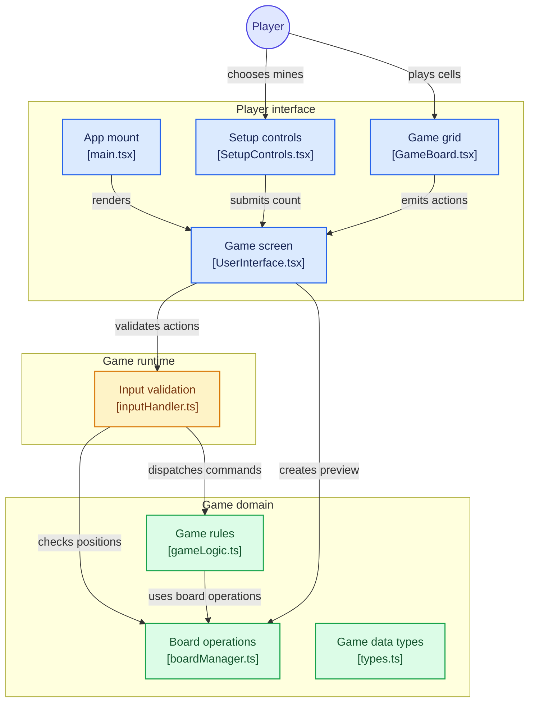

# The original architecture built by group 19

```mermaid

%% Generated by https://gitdiagram.com/heidischieb/eecs581-project1-minesweeper
flowchart TD

subgraph group_interface["Player interface"]
  node_mount["App mount<br/>[main.tsx]"]
  node_screen["Game screen<br/>[UserInterface.tsx]"]
  node_setup["Setup controls<br/>[SetupControls.tsx]"]
  node_grid["Game grid<br/>[GameBoard.tsx]"]
end

subgraph group_runtime["Game runtime"]
  node_inputs["Input validation<br/>[inputHandler.ts]"]
end

subgraph group_domain["Game domain"]
  node_rules["Game rules<br/>[gameLogic.ts]"]
  node_board["Board operations<br/>[boardManager.ts]"]
  node_contracts["Game data types<br/>[types.ts]"]
end

node_player(("Player"))

node_mount -->|"renders"| node_screen
node_player -->|"chooses mines"| node_setup
node_setup -->|"submits count"| node_screen
node_player -->|"plays cells"| node_grid
node_grid -->|"emits actions"| node_screen
node_screen -->|"validates actions"| node_inputs
node_inputs -->|"dispatches commands"| node_rules
node_inputs -->|"checks positions"| node_board
node_rules -->|"uses board operations"| node_board
node_screen -->|"creates preview"| node_board

click node_mount "https://github.com/heidischieb/eecs581-project1-minesweeper/blob/master/src/main.tsx"
click node_screen "https://github.com/heidischieb/eecs581-project1-minesweeper/blob/master/src/UserInterface.tsx"
click node_setup "https://github.com/heidischieb/eecs581-project1-minesweeper/blob/master/src/components/SetupControls.tsx"
click node_grid "https://github.com/heidischieb/eecs581-project1-minesweeper/blob/master/src/components/GameBoard.tsx"
click node_inputs "https://github.com/heidischieb/eecs581-project1-minesweeper/blob/master/src/inputHandler.ts"
click node_rules "https://github.com/heidischieb/eecs581-project1-minesweeper/blob/master/src/gameLogic.ts"
click node_board "https://github.com/heidischieb/eecs581-project1-minesweeper/blob/master/src/boardManager.ts"
click node_contracts "https://github.com/heidischieb/eecs581-project1-minesweeper/blob/master/src/types.ts"

classDef toneNeutral fill:#f8fafc,stroke:#334155,stroke-width:1.5px,color:#0f172a
classDef toneBlue fill:#dbeafe,stroke:#2563eb,stroke-width:1.5px,color:#172554
classDef toneAmber fill:#fef3c7,stroke:#d97706,stroke-width:1.5px,color:#78350f
classDef toneMint fill:#dcfce7,stroke:#16a34a,stroke-width:1.5px,color:#14532d
classDef toneRose fill:#ffe4e6,stroke:#e11d48,stroke-width:1.5px,color:#881337
classDef toneIndigo fill:#e0e7ff,stroke:#4f46e5,stroke-width:1.5px,color:#312e81
classDef toneTeal fill:#ccfbf1,stroke:#0f766e,stroke-width:1.5px,color:#134e4a
class node_mount,node_screen,node_setup,node_grid toneBlue
class node_inputs toneAmber
class node_rules,node_board,node_contracts toneMint
class node_player toneIndigo
```